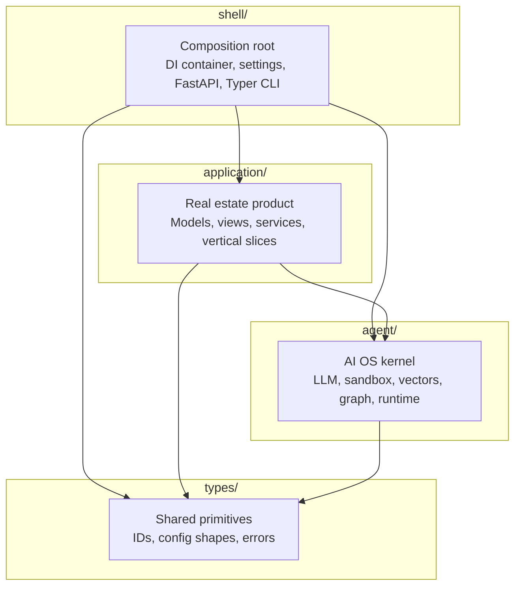
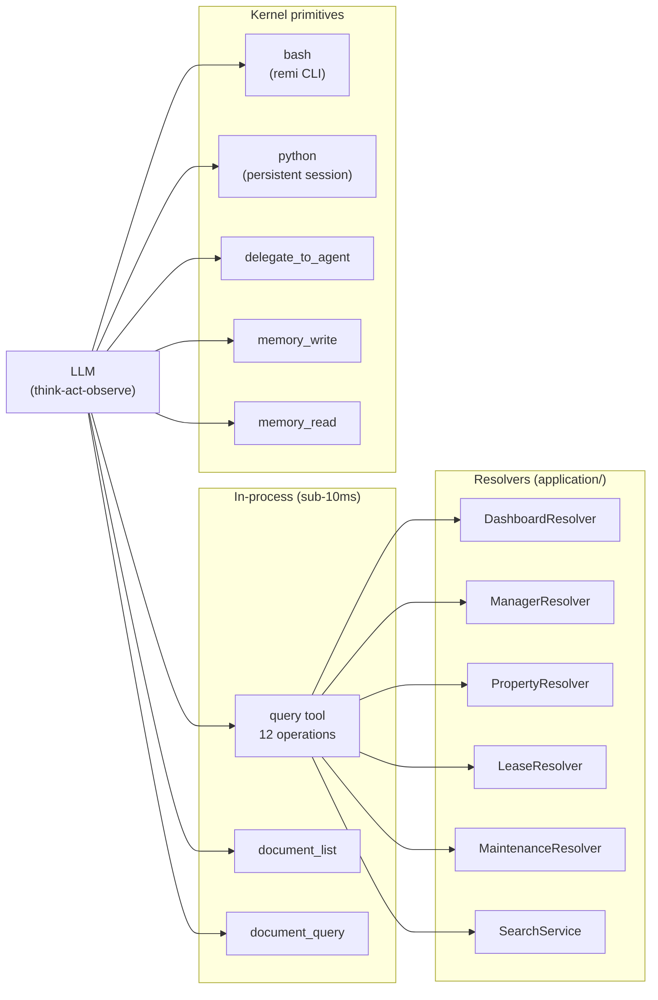
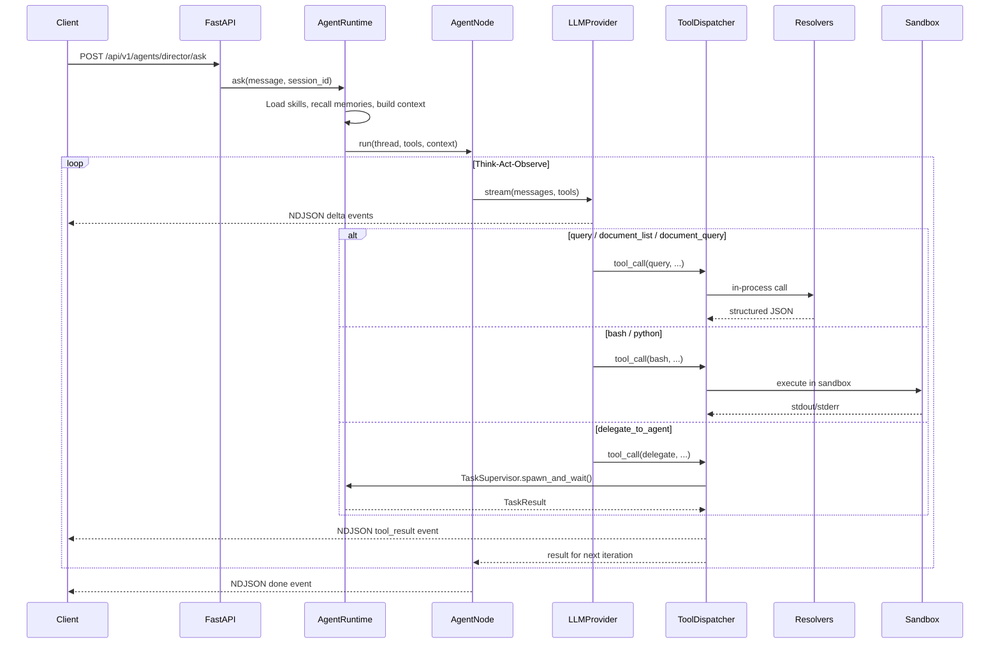
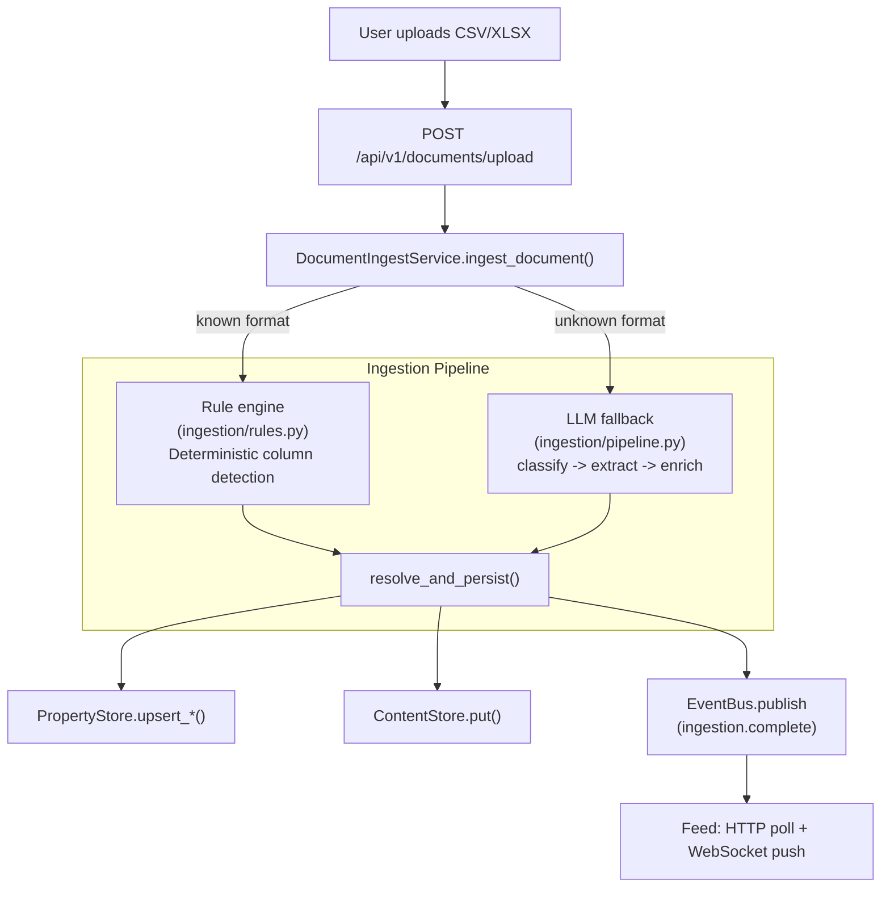
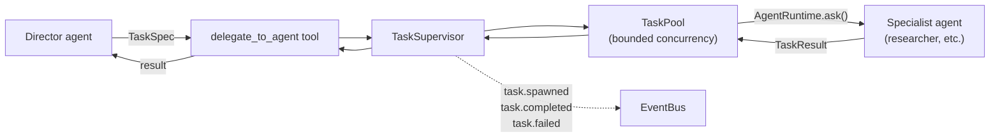
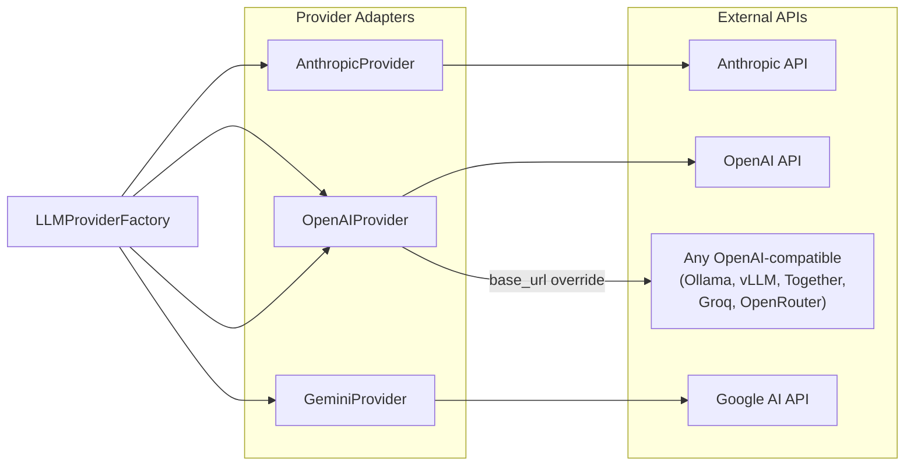

# REMI Architecture

## Overview

REMI is an **agent operating system for real estate** — a layered runtime that lets AI agents reason over a property management book of business. The architecture enforces a strict four-ring dependency model so the AI kernel remains reusable independent of the real estate domain, and the domain layer remains independent of delivery concerns.

---

## Four-Ring Dependency Model



**Dependency arrows always point inward.** `application/` may import from `agent/` and `types/`. `agent/` may only import from `types/`. `types/` imports nothing. `shell/` imports everything and is the only place where the rings are wired together.

---

## Packages

### `types/` — Shared vocabulary

Pure Pydantic models and constants. No I/O, no business logic, no framework imports.

- `config.py` — `RemiSettings` and all nested config shapes
- `paths.py` — canonical filesystem paths (`AGENTS_DIR`, `DOMAIN_YAML_PATH`)

### `agent/` — AI OS kernel

Everything needed to run an AI agent: provider adapters, execution sandbox, memory (with episode extraction and ranked recall), vector search, structured observation, skills, and multi-stage context compression. Contains no real estate concepts — it is domain-agnostic.

```
agent/
  llm/          Provider factory + adapters (Anthropic, OpenAI, Gemini)
  vectors/      Embedding port + adapters (in-memory, Postgres/pgvector)
  sandbox/      Code execution port + backends (local subprocess, Docker)
  graph/        Knowledge graph — types, bridge, retriever
  memory/       Agent memory — store, extraction, recall, importance-ranked
  events/       Typed event bus — the OS-level pub-sub nervous system
  documents/    Document types, in-memory + Postgres content stores
  db/           Async SQLAlchemy engine + agent-owned tables
  runtime/      Agent loop, tool dispatcher, streaming, multi-stage compaction
  tasks/        Supervised multi-agent delegation — TaskSpec, Task, Supervisor, Pool
  skills/       Skill discovery — filesystem-based markdown playbooks
  pipeline/     YAML-driven multi-stage LLM pipeline executor
  workflow/     YAML-driven multi-step workflow engine
  tools/        Kernel primitives only (bash, python, delegate, memory_store, memory_recall)
  sessions/     Chat session persistence (memory / Postgres)
  observe/      Tracing, structured logging, LLM usage ledger
  workspace/    Agent working memory (Markdown scratchpad)
```

### `application/` — Real estate product

The RE domain expressed in hexagonal (ports and adapters) style. Depends on `agent/` for AI infrastructure but defines its own domain models, protocols, and read models. Organized as vertical feature slices — each slice owns its API routes, CLI commands, resolvers, and models.

```
application/
  core/         Domain models (Property, Lease, Tenant, ...), protocols,
                business rules, domain events
  views/        Read models — computed views over the domain graph
                (DashboardResolver, RentRollResolver, LeaseResolver, ...)
  portfolio/    Portfolio slice — managers, properties, units (API + CLI)
  operations/   Operations slice — leases, maintenance, actions (API + CLI)
  intelligence/ Intelligence slice — dashboard, search, trends (API + CLI)
  ingestion/    Document ingestion pipeline, rules, CLI
  events/       Event feed projections: HTTP poll (api.py) + WebSocket push (ws.py)
  stores/       Port implementations — persistence adapters
    mem.py      InMemoryPropertyStore (dev/test)
    pg/         PostgresPropertyStore + tables + converters
    world.py    REWorldModel (knowledge graph over PropertyStore)
    indexer.py  AgentVectorSearch, AgentTextIndexer adapters
    events.py   InMemoryEventStore
    factory.py  build_store_suite (Postgres vs in-memory)
  tools/        Domain tool providers (QueryToolProvider, DocumentToolProvider)
  agents/       Agent YAML manifests (director, researcher, ...)
  profile.py    Domain profile builder
```

### `shell/` — Composition root

Wires all rings together. Contains no business logic. Registers kernel tool providers (sandbox, memory, delegation) and domain tool providers (query, documents).

```
shell/
  config/
    settings.py   Loads YAML + .env + env-var interpolation -> RemiSettings
    container.py  DI wiring — kernel + domain tool providers
    domain.yaml   Domain schema — entity types, relationships, processes
  api/
    main.py       FastAPI app factory + lifespan (bootstraps Container)
    middleware.py Request ID + structlog context injection
    error_handler.py Maps domain exceptions to HTTP error envelopes
  cli/
    main.py       Typer entry point (registers all command groups)
    output.py     Structured JSON envelope helpers (success/error)
    client.py     HTTP client mode — proxies to API when REMI_API_URL is set
```

---

## Tool Architecture

Every agent has a single tool surface declared in its YAML manifest. The LLM decides which tool to call — there is no mode-based router or classifier.



### Tool inventory

| Tool | Provider | What it does |
|------|----------|-------------|
| `query` | `QueryToolProvider` | In-process resolver dispatch — 12 operations covering dashboard, managers, properties, rent roll, rankings, delinquency, expiring leases, vacancies, leases, maintenance, and search |
| `document_list` | `DocumentToolProvider` | List documents with metadata, filter by manager/property |
| `document_query` | `DocumentToolProvider` | Search within document content by ID or text query |
| `bash` | `AnalysisToolProvider` | Shell commands + `remi` CLI for write operations and commands not in the query tool |
| `python` | `AnalysisToolProvider` | Persistent Python session — variables survive between calls. pandas, numpy, scipy available |
| `delegate_to_agent` | `DelegationToolProvider` | Supervised delegation to specialist agents via TaskSupervisor |
| `memory_write` | `MemoryToolProvider` | Write to agent long-term memory (keyed, namespaced, tagged) |
| `memory_read` | `MemoryToolProvider` | Query agent memory by text, entity, or tag |

### The `query` tool

`QueryToolProvider` (`application/tools/query.py`) is a single tool with an `operation` parameter that dispatches to the appropriate resolver in-process. One schema covers all read operations (~300 tokens vs ~4000 for separate tools). The LLM sends:

```json
{"operation": "delinquency", "manager_id": "jake-smith"}
```

The tool calls `DashboardResolver.delinquency_board(manager_id="jake-smith")` and returns structured JSON. No subprocess, no sandbox, sub-10ms latency.

Available operations: `dashboard`, `managers`, `manager_review`, `properties`, `rent_roll`, `rankings`, `delinquency`, `expiring_leases`, `vacancies`, `leases`, `maintenance`, `search`.

### Concepts

| Layer | What | Where |
|-------|------|-------|
| **Tool** | Kernel or domain primitive exposed via LLM function calling | `agent/tools/` + `application/tools/` |
| **Command** | `remi` CLI subcommand returning structured JSON | `application/{slice}/cli.py` |
| **Skill** | Markdown playbook with domain knowledge + CLI examples | `.remi/skills/{name}/SKILL.md` |

---

## Data Flow: Agent Conversation



The streaming response is NDJSON over the HTTP body. Event types: `delta` (text), `tool_call`, `tool_running`, `tool_result`, `phase`, `done`, `error`.

---

## Data Flow: Document Ingestion



The rule engine handles all known AppFolio report types (Property Directory, Rent Roll, Delinquency, Lease Expiration) with zero API calls. The LLM pipeline is invoked only for genuinely unknown formats, running a multi-step YAML workflow: classify the report, extract column mappings, optionally inspect sample rows for correction, then map and persist.

---

## Multi-Agent Delegation



Delegation edges are declared in YAML (`delegates_to:`), not in Python. The `Workforce` model assembles the complete agent topology from manifests at startup and enforces per-parent scoping.

---

## Storage Backends

| Layer | In-memory (dev) | Postgres (prod) |
|-------|-----------------|-----------------|
| Domain (properties, leases, ...) | `InMemoryPropertyStore` | `PostgresPropertyStore` |
| Document content | `InMemoryContentStore` | `PostgresContentStore` |
| Vector embeddings | `InMemoryVectorStore` | `PostgresVectorStore` (JSON today; pgvector planned) |
| Agent memory (4 namespaces) | `InMemoryMemoryStore` | `PostgresMemoryStore` |
| Chat sessions | `InMemoryChatSessionStore` | `PostgresChatSessionStore` (stubbed) |
| Traces/spans | `InMemoryTraceStore` | `PostgresTraceStore` (stubbed) |
| Domain events | `InMemoryEventStore` | not yet implemented |

Backend selection is controlled by `state_store.backend` (domain + content) and per-layer `vectors.backend`, `memory.backend`, `tracing.backend`, `sessions.backend` in the active YAML config.

---

## Sandbox Backends

| Backend | Mechanism | Isolation | Use case |
|---------|-----------|-----------|----------|
| `local` | `asyncio.create_subprocess_exec` + persistent Python interpreter per session | Process-level only; shares host kernel and network | Single-server dev/prod with trusted operators |
| `docker` | Docker-outside-of-Docker; one container per session using `remi-sandbox` image | Container boundary; no access to host filesystem or API secrets | Stronger isolation; requires Docker socket mount |

The active backend is selected by `settings.sandbox.backend` (env var `REMI_SANDBOX__BACKEND`).

Sessions idle longer than `settings.sandbox.session_ttl_seconds` are automatically reaped by a background task in the server lifespan (every 5 minutes).

---

## Networking

In a single-process deployment all internal calls are loopback (`127.0.0.1`). In containerised deployments the sandbox containers reach the API via Docker's internal network:

```
[remi-api container]
    |
    +-- spawns -> [remi-sandbox container]
    |                |
    |                +-- remi CLI -> REMI_API_URL (e.g. http://api:8000)
    |                    (client mode: shell/cli/client.py proxies to API)
    |                           |
    |            [Docker bridge network: remi_internal]
    |                           |
    +---------------------------+
```

Set `REMI_API__INTERNAL_API_URL=http://api:8000` so CLI commands inside the sandbox resolve to the correct API address.

---

## LLM Provider Infrastructure



All providers implement the `LLMProvider` ABC: `complete()`, `stream()`, `count_tokens()`, `model_capabilities()`. The factory resolves API keys from `SecretsSettings` and creates provider instances by name. The `openai_compatible` adapter reuses `OpenAIProvider` with a custom `base_url`, supporting any OpenAI-compatible endpoint.

Per-agent provider and model selection is declared in YAML manifests:

```yaml
config:
  provider: anthropic
  model: claude-sonnet-4-20250514
  tool_routing_provider: anthropic
  tool_routing_model: claude-haiku-4-5-20251001
```

Resolution order: request overrides > YAML config > global defaults from `RemiSettings.llm`.

---

## Agent Memory

Three-layer system in `agent/memory/`:

1. **Explicit tools** — `memory_write` and `memory_read` let the agent store and retrieve findings, corrections, and reference facts.
2. **Post-run extraction** — `extract_episode` distills completed conversations into structured observations classified by namespace and importance.
3. **Ranked recall** — `MemoryRecallService` searches all namespaces, ranks by importance and recency, and injects relevant memories into the system prompt before each run.

Four namespaces: `episodic` (session observations), `feedback` (user corrections), `reference` (curated facts), `plan` (working objectives). Three importance levels: routine (14d TTL), notable (90d), critical (permanent).

---

## Workflow Engine

The `WorkflowRunner` (`agent/workflow/engine.py`) is the single DAG scheduler for all multi-step execution:

| Kind | What it does |
|------|-------------|
| `llm` | Single LLM call with template interpolation |
| `llm_tools` | LLM call with tool access (multi-round) |
| `transform` | Deterministic tool call — no LLM |
| `for_each` | Fan-out: run a tool over each item in a list |
| `gate` | Conditional branch — enables/disables downstream steps |
| `agent` | Full agent loop — runs a named agent via `AgentRuntime.ask()` |

Workflows are declared in YAML. Steps declare `depends_on` for explicit DAG edges and `wires` for data routing between steps. The engine runs steps concurrently where dependencies allow.

---

## Settings Resolution Order

For each setting, later sources win:

1. Default in `RemiSettings` / nested model
2. `config/base.yaml`
3. `config/{REMI_CONFIG_ENV}.yaml`
4. `.env` file (does not override already-set env vars)
5. Environment variables (`DATABASE_URL`, `ANTHROPIC_API_KEY`, `REMI_LLM_*`, `REMI_SANDBOX__*`, `REMI_API__*`, etc.)

---

## Key Invariants

- `types/` imports nothing from `agent/`, `application/`, or `shell/`
- `agent/` never imports from `application/` or `shell/`
- `application/` never imports from `shell/`
- `container.py` is pure wiring — no business logic, no factory decisions
- Factory functions live in the module that owns the thing being built
- Domain schema (entity types, relationships, processes) lives in `shell/config/domain.yaml`
- All tools are available to every request — the LLM picks what to use
- No mode-scoped tool sets, no request router, no intent classifier
